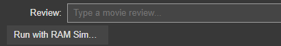
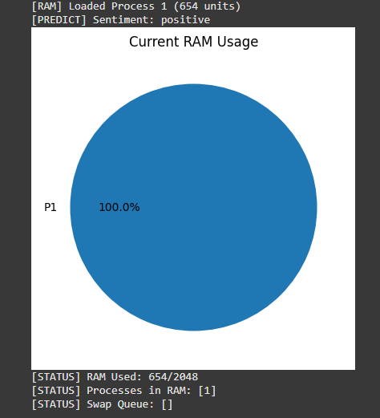

# Movie Sentiment Analysis With Process Swapping Simulation
</br>

## Table of Contents
- [Codes](#codes)
- [Commands](#commands)
- [raw datasets](#rawdataset)

## Raw datasets
In order to train the machine learning for movie sentiment analysis, we used the movie review dataset from this link : https://www.kaggle.com/datasets/lakshmi25npathi/imdb-dataset-of-50k-movie-reviews </br>
Since the file size is to large to be uploaded on GitHub, you need to download it from Kaggle by yourself instead. </br>
We are so sorry for your inconvenience. </br>
The dataset file name is 'IMDB Dataset.csv'. 

To download it, you need to sign-in/sign-up a Kaggle account. 
Then click the 'Download' button on the top right corner of the website shown in the picture: </br>
<div align="center">

</div>

Lastly, you need to extract the file named : 'archive.zip' to get the dataset.</br>
Now, your 'IMDB Dataset.csv' is ready
</br>

## Codes

Paste all of code cells on your python complier (Google Colab suggested) : 
</br> We will go through each block of code and describe their functionalities.
</br> Please run the code in the following order. 

1) **Uploading dataset:** </br>
Select the the 'IMDB Dataset.csv' from you local device after you have run this code block. </br>
Plese wait until the dataset is 100% uploaded before you run the next code cell.
```
from google.colab import files
uploaded = files.upload()
``` 
</br>

2) **Load dataset:**</br>
Load the uploaded dataset into Pandas dataframe called df and display the first 5 rows to test if it is correctly loaded or not
```
import pandas as pd

# Load dataset
df = pd.read_csv("IMDB Dataset.csv")
df.head()
```
</br>

3) **Preprocessing – Encoding & Vectorization:**</br>
Encode the target labels (sentiment), Split the data into training and test sets, Convert text reviews into numerical vectors using TF-IDF.
```
from sklearn.model_selection import train_test_split
from sklearn.feature_extraction.text import TfidfVectorizer
from sklearn.preprocessing import LabelEncoder

# Encode labels
label_encoder = LabelEncoder()
df['sentiment'] = label_encoder.fit_transform(df['sentiment'])  # 0 = negative, 1 = positive

# Split data
X_train, X_test, y_train, y_test = train_test_split(df['review'], df['sentiment'], test_size=0.2, random_state=42)

# Text to TF-IDF
vectorizer = TfidfVectorizer(max_features=5000)
X_train_vec = vectorizer.fit_transform(X_train)
X_test_vec = vectorizer.transform(X_test)
``` 
</br>

4) **Model Training & Evaluation:**</br>
Trains a logistic regression model on the TF-IDF-transformed training data.
- Expecting output :
  - Accuracy score on the test data
  - Classification report (precision, recall, F1, support).
```
from sklearn.linear_model import LogisticRegression
from sklearn.metrics import accuracy_score, classification_report

model = LogisticRegression()
model.fit(X_train_vec, y_train)

y_pred = model.predict(X_test_vec)
print("Accuracy:", accuracy_score(y_test, y_pred))
print(classification_report(y_test, y_pred, target_names=["negative", "positive"]))
```

</br>

5) **RAM Simulation Class:**</br>
- Propose: Models processes and simulates loading/swapping them in RAM using FIFO or LRU.
- Key Features:
  - RAM size is limited *(max_ram)*.
  - When a new process doesn't fit, *swap_out()* is triggered.
  - Logs every load/swap into a file *(prediction_log.txt)*.
```
import time
from collections import deque

class SimulatedProcess:
    def __init__(self, pid, text):
        self.pid = pid
        self.text = text #The text input associated with the process
        self.size = len(text) #length of the text
        self.timestamp = time.time() #The time the process was created. This is critical for LRU swapping—older timestamps mean the process is "less recently used".


class RamSimulator:
    def __init__(self, max_ram=1000, policy="LRU"):
        self.max_ram = max_ram #Total capacity of RAM by default = 1000 units
        self.policy = policy #Determines the swap-out strategy ("LRU" or "FIFO"). In this case we always use LRU
        self.ram = [] #A list to store all currently loaded SimulatedProcesses.
        self.swap = deque() #A queue to store the swapped-out processes (those pushed to virtual memory).
        self.used = 0 # Tracks how much RAM is currently used.

    def load_process(self, process):
        while self.used + process.size > self.max_ram:
            self.swap_out()
        self.ram.append(process)
        self.used += process.size
        print(f"[RAM] Loaded Process {process.pid} ({process.size} units)")

        # Log to file
        with open("prediction_log.txt", "a") as f:
            f.write(f"Loaded: PID={process.pid}, Size={process.size}, RAM used={self.used}/{self.max_ram}\n")

    def swap_out(self):
        if not self.ram:
            print("[SWAP] No process to swap out!")
            return
        if self.policy == "FIFO":
            victim = self.ram.pop(0)
        elif self.policy == "LRU":
            victim = min(self.ram, key=lambda p: p.timestamp)
            self.ram.remove(victim)
        else:
            raise ValueError("Unknown policy")

        self.used -= victim.size
        self.swap.append(victim)
        print(f"[SWAP] Swapped out Process {victim.pid} ({victim.size} units)")

        # Log to file
        with open("prediction_log.txt", "a") as f:
            f.write(f"Swapped out: PID={victim.pid}, Size={victim.size}, RAM used={self.used}/{self.max_ram}\n")
```

</br>

6) **RAM Visualization:**</br>
Uses matplotlib to draw a pie chart of current RAM usage.
```
import matplotlib.pyplot as plt

def visualize_ram(sim):
    if not sim.ram:
        print("[VISUALIZE] RAM is currently empty.")
        return

    labels = [f"P{p.pid}" for p in sim.ram]
    sizes = [p.size for p in sim.ram]

    plt.figure(figsize=(5, 5))
    plt.pie(sizes, labels=labels, autopct='%1.1f%%')
    plt.title("Current RAM Usage")
    plt.show()

    print(f"[STATUS] RAM Used: {sim.used}/{sim.max_ram}")
    print(f"[STATUS] Processes in RAM: {[p.pid for p in sim.ram]}")
    print(f"[STATUS] Swap Queue: {[p.pid for p in sim.swap]}")
```

</br>

7) **Prediction + RAM Simulation Integration:**</br>
- Creates a new *SimulatedProcess* for each user input.
- Loads it into RAM (or swaps if needed).
- Uses the trained ML model to predict the sentiment.
- Visualizes current RAM state.
```
# Initialize simulator and counter
sim = RamSimulator(max_ram=2048, policy="LRU")
pid_counter = 1
max_predictions = 8  #This no. is able to be changed depending on how many predictions we want to predict
prediction_counter = 0

def predict_with_ram_sim(text):
    global pid_counter, prediction_counter

    if prediction_counter >= max_predictions:
        print("⛔ Simulation limit reached. No more predictions allowed.")
        return

    proc = SimulatedProcess(pid=pid_counter, text=text)
    pid_counter += 1

    sim.load_process(proc)

    # Predict
    vec = vectorizer.transform([text])
    pred = model.predict(vec)
    pred_class = model.predict(vec)[0]
    label = label_encoder.inverse_transform([pred_class])[0]
    print(f"[PREDICT] Sentiment: {label}")

    # Visualize RAM
    visualize_ram(sim)

    # Log prediction (optional)
    with open("prediction_log.txt", "a") as f:
        f.write(f"PID: {proc.pid}, Text size: {proc.size}, Sentiment: {label}\n")

    prediction_counter += 1

    # Disable input after reaching max
    if prediction_counter >= max_predictions:
        print("\n✅ Done! Prediction limit reached.")
        predict_button.disabled = True
        text_box.disabled = True
```
</br>

8) **GUI for User Input:**

Creates an interactive UI in the Jupyter Notebook using ipywidgets so the user can:
- Type a movie review.
- Click a button to trigger sentiment prediction with RAM simulation.


```
import ipywidgets as widgets
from IPython.display import display

text_box = widgets.Text(
    value='',
    placeholder='Type a movie review...',
    description='Review:',
    layout=widgets.Layout(width='80%')
)

predict_button = widgets.Button(description="Run with RAM Simulation")

def on_click(b):
    if text_box.value.strip():
        predict_with_ram_sim(text_box.value)

predict_button.on_click(on_click)
display(text_box, predict_button)
```

## Commands

1. Let's test the Sentiment Analysis and Ram visualization:
   - Use a Minecraft Movie review from IMDB website which rating of 9/10
   - Expected Analyis: *positive*
   ```review
   Genuinely, this movie was so shocking in the best way possible. The trailers did NOT do it justice. From start to finish, it was entertaining, funny, silly and ridiculous. The Digital Effects are great, and so is the acting. It was surprisingly violent too. It had some pretty.. shocking imagery to say the least, and could definitely scare younger viewers. I'd been expecting this movie to be written weird, with lots of plotholes and forced dialogue, but oh was I wrong. This is a genuine funny little comforting movie, that anyone could find enjoyable. This is absolutely one of, if not my favourite video game movie interpretations. Good job, Mojang!
   ```
   - Place the review on this input box : 
<div align="center">

</div>
   - Then press on the *'Run with RAM Simulation'* button below to see the result.
   - The Output should be as shown : </br>
<div align="center">

</div>

