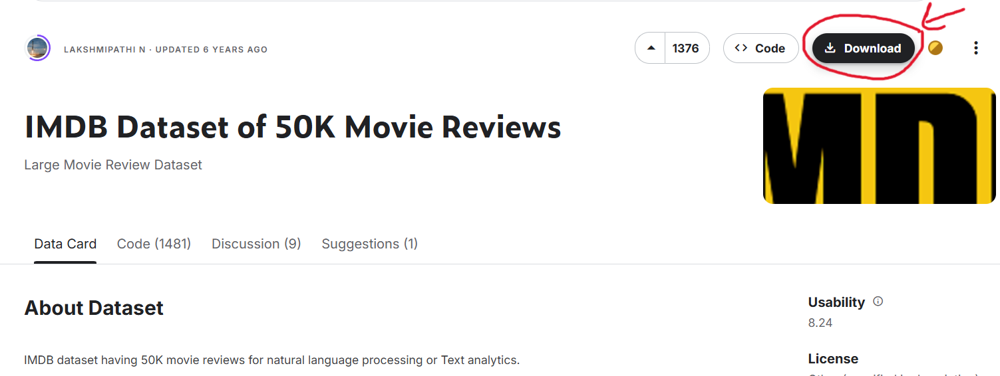

# Movie Sentiment Analysis With Process Swapping Simulation
</br>

## Table of Contents
- [Codes](#codes)
- [Commands](#commands)
- [raw datasets](#rawdataset)

## Raw datasets
In order to train the machine learning for movie sentiment analysis, we used the movie review dataset from this link : https://www.kaggle.com/datasets/lakshmi25npathi/imdb-dataset-of-50k-movie-reviews </br>
The dataset file name is 'IMDB Dataset.csv'. 

To download it, you need to sign-in/sign-up a Kaggle account. 
Then click the 'Download' button on the top right corner of the website shown in the picture: </br>
<div align="center">

</div>

Lastly, you need to extract the file named : 'archive.zip' to get the dataset.</br>
Now, your 'IMDB Dataset.csv' is ready
</br>
## Codes

Before beginning installation, ensure you have:

- **Node.js** installed (see installation instructions below)
- **MySQL** installed and running
- **Visual Studio Code** or another code editor

 ```
   PORT = 3100
   
   DB_HOST = localhost
   DB_USERNAME = yuedleaw
   DB_PASSWORD = yuedleaw888
   DB_DATABASE = YuedLeaw_db
   ```

## Commands

1. Check if Node.js is already installed:
   ```bash
   node --version
   ```
   If it shows a version number, you can skip to the next section.


